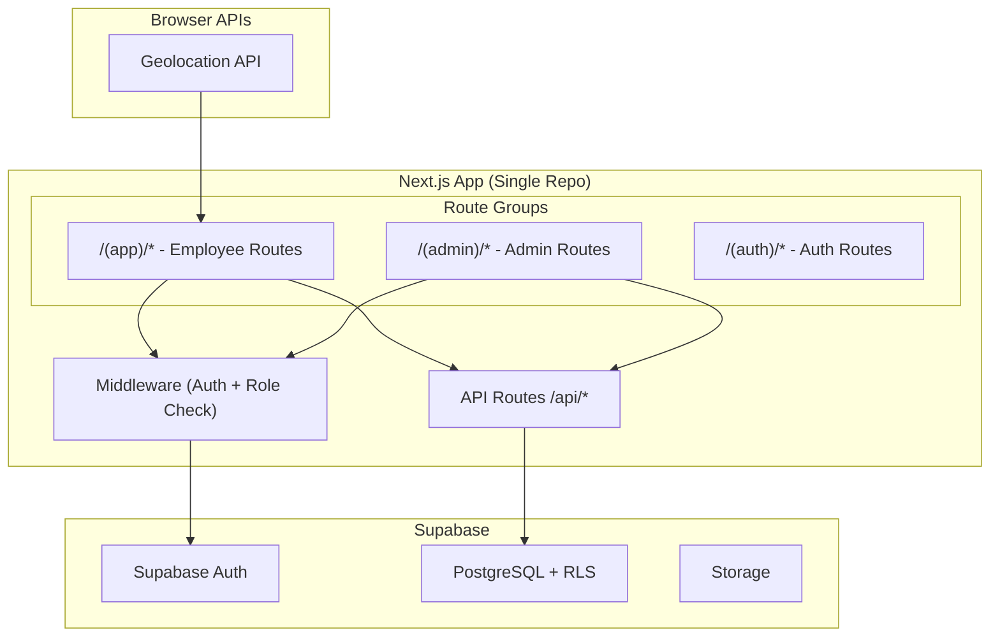

# Design Document: Attendance App

## Overview

Ứng dụng chấm công xây dựng trên Next.js 14 (App Router) và Supabase, nằm trong cùng một monorepo. Hệ thống chia thành hai phần chính thông qua route groups: `/app` cho nhân viên và `/admin` cho quản trị viên. Xác thực và phân quyền sử dụng Supabase Auth kết hợp Row Level Security (RLS). Tính năng chấm công dựa trên GPS sử dụng Browser Geolocation API và công thức Haversine để tính khoảng cách.

## Architecture



### Kiến trúc tổng quan

- **Next.js App Router**: Sử dụng route groups để tách biệt phần App `/(app)` và Admin `/(admin)` trong cùng một project
- **Middleware**: Xử lý xác thực và phân quyền ở tầng routing, kiểm tra session và role trước khi cho phép truy cập
- **API Routes**: Server-side endpoints xử lý logic nghiệp vụ (check-in, check-out, CRUD operations)
- **Supabase Client**: Sử dụng `@supabase/ssr` cho server-side rendering và `@supabase/supabase-js` cho client-side
- **RLS Policies**: Bảo mật dữ liệu ở tầng database, đảm bảo employee chỉ thấy dữ liệu của mình

## Components and Interfaces

### 1. Authentication Module

```typescript
// lib/supabase/middleware.ts
// Middleware kiểm tra auth session và redirect theo role

interface AuthSession {
  user: {
    id: string;
    email: string;
    role: 'employee' | 'admin';
  };
  accessToken: string;
}

// Hàm kiểm tra và refresh session
function updateSession(request: NextRequest): Promise<NextResponse>;
```

### 2. Geolocation Module

```typescript
// lib/geo/haversine.ts
// Tính khoảng cách giữa 2 tọa độ GPS

interface Coordinates {
  latitude: number;
  longitude: number;
}

interface DistanceResult {
  distanceInMeters: number;
  isWithinRadius: boolean;
}

// Tính khoảng cách bằng công thức Haversine
function calculateDistance(
  point1: Coordinates,
  point2: Coordinates
): number; // returns meters

// Kiểm tra có nằm trong bán kính cho phép không
function isWithinAllowedRadius(
  employeeLocation: Coordinates,
  officeLocation: Coordinates,
  allowedRadiusMeters: number
): DistanceResult;
```

### 3. Attendance Module

```typescript
// lib/attendance/service.ts

interface CheckInRequest {
  employeeId: string;
  latitude: number;
  longitude: number;
}

interface CheckInResponse {
  success: boolean;
  record?: AttendanceRecord;
  error?: {
    code: 'OUT_OF_RANGE' | 'ALREADY_CHECKED_IN' | 'NO_LOCATION_ASSIGNED';
    currentDistance?: number;
    allowedRadius?: number;
    message: string;
  };
}

interface CheckOutRequest {
  employeeId: string;
  latitude: number;
  longitude: number;
}

interface CheckOutResponse {
  success: boolean;
  record?: AttendanceRecord;
  workHours?: number;
  error?: {
    code: 'OUT_OF_RANGE' | 'NOT_CHECKED_IN' | 'ALREADY_CHECKED_OUT';
    currentDistance?: number;
    allowedRadius?: number;
    message: string;
  };
}

// Tính work hours từ check-in đến check-out
function calculateWorkHours(checkIn: Date, checkOut: Date): number;
```

### 4. Admin Module

```typescript
// lib/admin/employee-service.ts

interface EmployeeListParams {
  page: number;
  pageSize: number;
  search?: string;
}

interface EmployeeListResponse {
  employees: EmployeeProfile[];
  total: number;
  page: number;
  pageSize: number;
}

// lib/admin/report-service.ts

interface ReportParams {
  employeeId?: string;
  startDate: string; // ISO date
  endDate: string;   // ISO date
}

interface ReportSummary {
  employeeId: string;
  employeeName: string;
  totalWorkHours: number;
  daysPresent: number;
  daysAbsent: number;
  records: AttendanceRecord[];
}

// Xuất CSV
function generateCSV(reports: ReportSummary[]): string;
```


### 5. Location Management Module

```typescript
// lib/admin/location-service.ts

interface CreateLocationRequest {
  name: string;
  latitude: number;
  longitude: number;
  allowedRadius: 50 | 100; // meters
}

interface AssignLocationRequest {
  employeeId: string;
  locationId: string;
}
```

### 6. UI Components Structure

```
/(auth)/login/page.tsx          - Trang đăng nhập
/(app)/layout.tsx               - Layout cho nhân viên
/(app)/dashboard/page.tsx       - Trang chấm công (check-in/out)
/(app)/history/page.tsx         - Lịch sử chấm công
/(admin)/layout.tsx             - Layout cho admin
/(admin)/dashboard/page.tsx     - Tổng quan admin
/(admin)/employees/page.tsx     - Quản lý nhân viên
/(admin)/reports/page.tsx       - Báo cáo chấm công
/(admin)/locations/page.tsx     - Cấu hình địa điểm
```

## Data Models

### Database Schema (Supabase PostgreSQL)

```sql
-- Bảng profiles mở rộng từ auth.users
CREATE TABLE profiles (
  id UUID PRIMARY KEY REFERENCES auth.users(id) ON DELETE CASCADE,
  full_name TEXT NOT NULL,
  email TEXT NOT NULL UNIQUE,
  role TEXT NOT NULL CHECK (role IN ('employee', 'admin')) DEFAULT 'employee',
  office_location_id UUID REFERENCES office_locations(id),
  is_active BOOLEAN NOT NULL DEFAULT true,
  created_at TIMESTAMPTZ NOT NULL DEFAULT now(),
  updated_at TIMESTAMPTZ NOT NULL DEFAULT now()
);

-- Bảng địa điểm chấm công
CREATE TABLE office_locations (
  id UUID PRIMARY KEY DEFAULT gen_random_uuid(),
  name TEXT NOT NULL,
  latitude DOUBLE PRECISION NOT NULL CHECK (latitude >= -90 AND latitude <= 90),
  longitude DOUBLE PRECISION NOT NULL CHECK (longitude >= -180 AND longitude <= 180),
  allowed_radius INTEGER NOT NULL CHECK (allowed_radius IN (50, 100)),
  created_at TIMESTAMPTZ NOT NULL DEFAULT now(),
  updated_at TIMESTAMPTZ NOT NULL DEFAULT now()
);

-- Bảng chấm công
CREATE TABLE attendance_records (
  id UUID PRIMARY KEY DEFAULT gen_random_uuid(),
  employee_id UUID NOT NULL REFERENCES profiles(id),
  check_in_time TIMESTAMPTZ NOT NULL,
  check_out_time TIMESTAMPTZ,
  check_in_latitude DOUBLE PRECISION NOT NULL,
  check_in_longitude DOUBLE PRECISION NOT NULL,
  check_out_latitude DOUBLE PRECISION,
  check_out_longitude DOUBLE PRECISION,
  work_hours NUMERIC(5,2),
  date DATE NOT NULL DEFAULT CURRENT_DATE,
  created_at TIMESTAMPTZ NOT NULL DEFAULT now(),
  updated_at TIMESTAMPTZ NOT NULL DEFAULT now(),
  UNIQUE(employee_id, date)
);

-- RLS Policies
ALTER TABLE attendance_records ENABLE ROW LEVEL SECURITY;

-- Employee chỉ đọc record của mình
CREATE POLICY "employees_read_own" ON attendance_records
  FOR SELECT USING (auth.uid() = employee_id);

-- Employee chỉ insert record của mình
CREATE POLICY "employees_insert_own" ON attendance_records
  FOR INSERT WITH CHECK (auth.uid() = employee_id);

-- Employee chỉ update record của mình
CREATE POLICY "employees_update_own" ON attendance_records
  FOR UPDATE USING (auth.uid() = employee_id);

-- Admin đọc tất cả
CREATE POLICY "admins_read_all" ON attendance_records
  FOR SELECT USING (
    EXISTS (SELECT 1 FROM profiles WHERE id = auth.uid() AND role = 'admin')
  );

ALTER TABLE profiles ENABLE ROW LEVEL SECURITY;
ALTER TABLE office_locations ENABLE ROW LEVEL SECURITY;

-- Profile policies
CREATE POLICY "users_read_own_profile" ON profiles
  FOR SELECT USING (auth.uid() = id);

CREATE POLICY "admins_manage_profiles" ON profiles
  FOR ALL USING (
    EXISTS (SELECT 1 FROM profiles WHERE id = auth.uid() AND role = 'admin')
  );

-- Location policies (admin only)
CREATE POLICY "admins_manage_locations" ON office_locations
  FOR ALL USING (
    EXISTS (SELECT 1 FROM profiles WHERE id = auth.uid() AND role = 'admin')
  );

CREATE POLICY "employees_read_locations" ON office_locations
  FOR SELECT USING (true);
```

### TypeScript Types

```typescript
interface Profile {
  id: string;
  full_name: string;
  email: string;
  role: 'employee' | 'admin';
  office_location_id: string | null;
  is_active: boolean;
  created_at: string;
  updated_at: string;
}

interface OfficeLocation {
  id: string;
  name: string;
  latitude: number;
  longitude: number;
  allowed_radius: 50 | 100;
  created_at: string;
  updated_at: string;
}

interface AttendanceRecord {
  id: string;
  employee_id: string;
  check_in_time: string;
  check_out_time: string | null;
  check_in_latitude: number;
  check_in_longitude: number;
  check_out_latitude: number | null;
  check_out_longitude: number | null;
  work_hours: number | null;
  date: string;
  created_at: string;
  updated_at: string;
}
```


## Correctness Properties

*A property is a characteristic or behavior that should hold true across all valid executions of a system — essentially, a formal statement about what the system should do. Properties serve as the bridge between human-readable specifications and machine-verifiable correctness guarantees.*

### Property 1: Haversine distance calculation is correct and symmetric

*For any* two valid GPS coordinates (lat1, lon1) and (lat2, lon2), the Haversine distance from point A to point B should equal the distance from point B to point A, and the distance from any point to itself should be 0.

**Validates: Requirements 2.1, 2.2, 2.3, 2.4**

### Property 2: Distance-based check-in/out validation

*For any* employee location, office location, and allowed radius, the check-in/out validation should return success if and only if the Haversine distance between the two locations is less than or equal to the allowed radius.

**Validates: Requirements 2.1, 2.2, 2.3, 2.4**

### Property 3: Attendance state machine transitions

*For any* employee on a given day, the attendance state follows a strict sequence: `no_record` → `checked_in` → `checked_out`. The available action in `no_record` state is check-in only, in `checked_in` state is check-out only, and in `checked_out` state no action is available.

**Validates: Requirements 2.5, 2.6, 2.7**

### Property 4: Work hours calculation

*For any* two timestamps where check-out is after check-in, the calculated work hours should equal the difference in hours between check-out and check-in, rounded to 2 decimal places.

**Validates: Requirements 2.8**

### Property 5: Date range filtering returns only records within range

*For any* set of attendance records and any date range (startDate, endDate), filtering should return only records whose date falls within the inclusive range [startDate, endDate], and no records outside that range.

**Validates: Requirements 3.2, 5.3**

### Property 6: Role-based route access

*For any* user role and route path, access is granted if and only if: employees can access `/(app)/*` routes, admins can access both `/(app)/*` and `/(admin)/*` routes, and no other combinations are permitted.

**Validates: Requirements 6.1, 6.2, 6.3**

### Property 7: Attendance record serialization round-trip

*For any* valid AttendanceRecord object, serializing it to a database row and then deserializing it back should produce an object equivalent to the original.

**Validates: Requirements 7.5, 7.6**

### Property 8: Report summary computation

*For any* set of attendance records for an employee within a date range, the computed summary should have: total work hours equal to the sum of individual work_hours, days present equal to the count of records with check-in, and days absent equal to total working days minus days present.

**Validates: Requirements 5.4**

### Property 9: CSV export contains all report data

*For any* set of report summaries, the generated CSV should contain one header row and one data row per employee, and parsing the CSV back should recover all employee names, total work hours, days present, and days absent values.

**Validates: Requirements 5.5**

### Property 10: Employee search filtering

*For any* list of employees and a search term, the filtered results should contain only employees whose name or email contains the search term (case-insensitive), and all matching employees should be included.

**Validates: Requirements 4.4**

### Property 11: Pagination correctness

*For any* list of employees, page number, and page size, the returned page should contain at most pageSize items, the items should be a contiguous subset of the full list, and the total count should equal the full list length.

**Validates: Requirements 4.1**

### Property 12: Allowed radius validation

*For any* input value for allowed radius, the system should accept the value if and only if it is exactly 50 or 100 (meters).

**Validates: Requirements 8.4**

## Error Handling

### Client-Side Errors

| Scenario | Handling |
|---|---|
| Geolocation unavailable/denied | Hiển thị thông báo yêu cầu bật GPS, disable nút check-in/out |
| Ngoài bán kính cho phép | Hiển thị khoảng cách hiện tại và bán kính yêu cầu |
| Đã check-in rồi | Hiển thị thông báo, chuyển sang nút check-out |
| Đã check-out rồi | Disable cả hai nút, hiển thị thông báo hoàn thành |
| Network error | Hiển thị toast error, cho phép retry |
| Session expired | Redirect về trang login |

### Server-Side Errors

| Scenario | Handling |
|---|---|
| Duplicate check-in (race condition) | UNIQUE constraint trên (employee_id, date) trả về conflict error |
| Invalid coordinates | Validate latitude [-90, 90] và longitude [-180, 180] |
| Unauthorized access | RLS policy deny + API middleware trả về 403 |
| Database connection error | Trả về 500 với generic error message |

## Testing Strategy

### Testing Framework

- **Unit tests**: Vitest (tích hợp tốt với Next.js)
- **Property-based tests**: fast-check (thư viện PBT phổ biến cho TypeScript)
- **Component tests**: React Testing Library (nếu cần test UI components)

### Unit Tests

Unit tests tập trung vào:
- Specific examples cho Haversine calculation (known distances)
- Edge cases: same point (distance = 0), antipodal points, equator crossings
- Error conditions: invalid coordinates, missing data
- Integration points: Supabase client calls (mocked)

### Property-Based Tests

Mỗi property test sẽ:
- Chạy tối thiểu 100 iterations
- Sử dụng fast-check arbitraries để generate random inputs
- Được annotate với comment tham chiếu đến property trong design document
- Format tag: **Feature: attendance-app, Property {number}: {title}**

Danh sách property tests:
1. Haversine symmetry and identity
2. Distance-based validation correctness
3. Attendance state machine transitions
4. Work hours calculation
5. Date range filtering
6. Role-based route access
7. Serialization round-trip
8. Report summary computation
9. CSV export round-trip
10. Employee search filtering
11. Pagination correctness
12. Allowed radius validation

### Test Organization

```
__tests__/
  lib/
    geo/
      haversine.test.ts          - Unit + Property tests cho Haversine
    attendance/
      service.test.ts            - Unit + Property tests cho attendance logic
      state-machine.test.ts      - Property tests cho state machine
    admin/
      report-service.test.ts     - Unit + Property tests cho reports
      employee-service.test.ts   - Unit + Property tests cho employee management
      location-service.test.ts   - Unit + Property tests cho location management
    auth/
      role-access.test.ts        - Property tests cho role-based access
```
